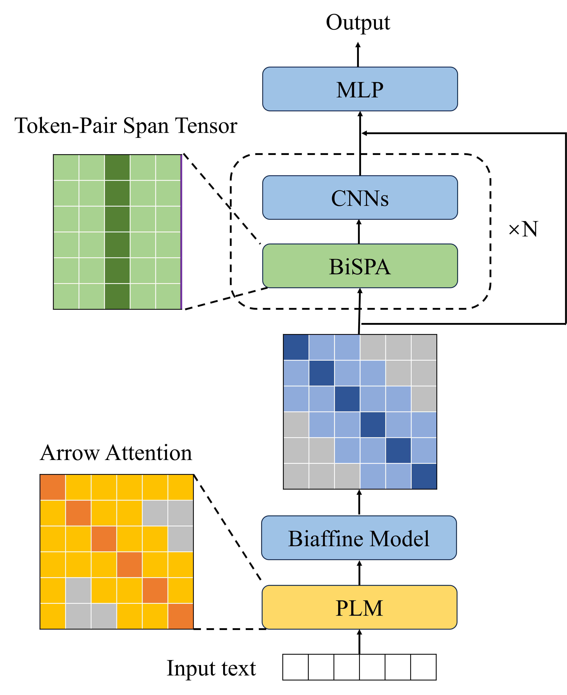

<div align="center">

# Small Language Model Makes an Effective Long Text Extractor (AAAI 2025)

</div>



*Official code and data of the paper Small Language Model Makes an Effective Long Text Extractor.*

<p align="center">
   📃 <a href="https://arxiv.org/abs/2411.02337" target="_blank"> Paper </a> | 🤗 <a href="https://huggingface.co/THUDM/webrl-glm-4-9b" target="_blank"> WebRL-GLM-4-9B </a> | <a href="https://huggingface.co/THUDM/webrl-llama-3.1-8b" target="_blank"> WebRL-LLaMA-3.1-8B </a> | <a href="https://www.modelscope.cn/collections/WebRL-77a3e54a2dde4b" target="_blank"> ModelScope </a>
</p>

***

SeNER, a lightweight span-based NER method with efficient attention mechanisms that enhance long-text encoding and extraction, reduce redundant computations, and achieve state-of-the-art accuracy while being GPU-memory-friendly. 

## 🚀 Quick Start

### Dependencies

First, create a conda environment and install all pip package requirements.

```bash
conda create -n sener python==3.11.9
conda activate sener

cd scholar-profiling/sener
pip install -r requirements.txt
```

### Model checkpoints

The checkpoints has been released here and we use it:

- [scholar-xl checkpoint](https://huggingface.co/THUDM/webrl-glm-4-9b)
- [SciREX checkpoint](https://huggingface.co/THUDM/webrl-llama-3.1-8b)
- [profiling-07 checkpoint](https://huggingface.co/THUDM/webrl-llama-3.1-70b)

### Model checkpoints

The processed data has been released here. We download it and put it in ./data:

- [scholar-xl data](./data/scholar-xl)
- [SciREX data](./data/SciREX)
- [profiling-07 data](./data/profiling-07)

### File structure

You can follow a similar format for processing your data, and then go on to train your own model.

```tree
    - data/
        - scholar-xl
          -train.json
          -dev.json
          -test.json
        - SciREX
        - profiling-07
    - log
    - models/
        - cnn.py
        - metrics.py
        - model.py
    - outputs
    - PLM
    - utils/
        - data_loader.py
        - logger.py
    - predict.py
    - predict.sh
    - train.py
    - train.sh  

```

### ✈️ Train model

We use Deberta-v3-large as the backbone. You can train SeNER with the following commands:

```bash
bash train.sh
```

### 🛜 Evaluation

```bash
bash train.sh
```

## Citation
```
...
```
